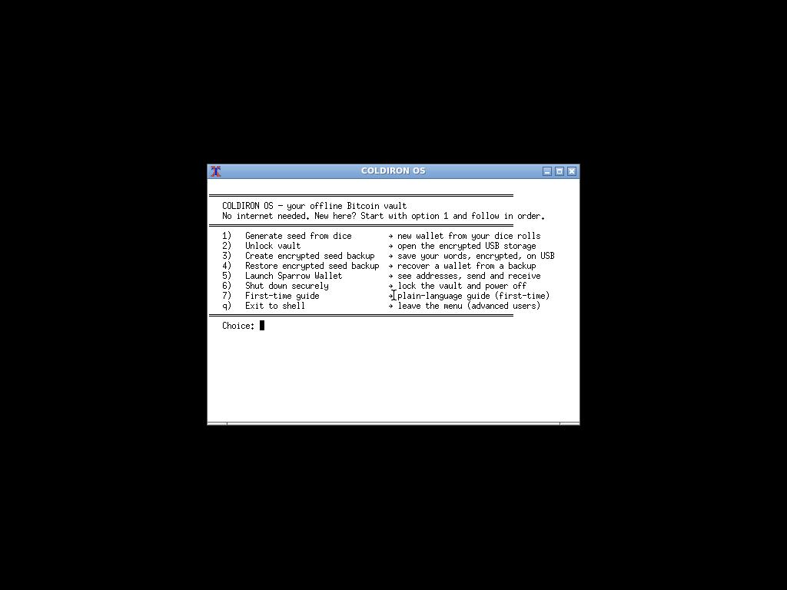
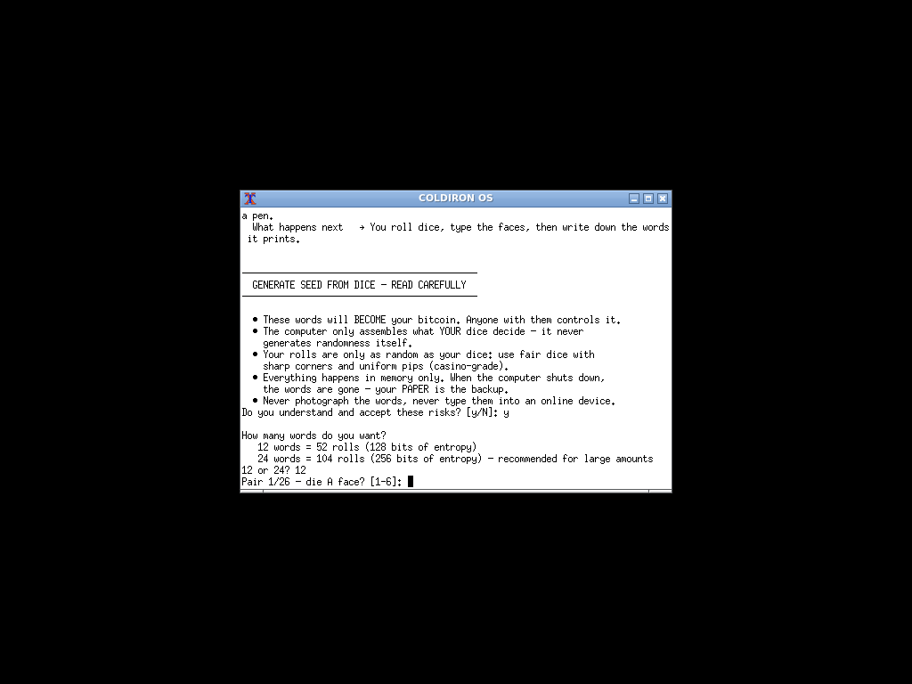
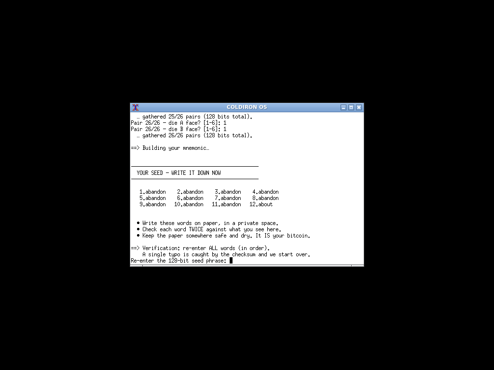
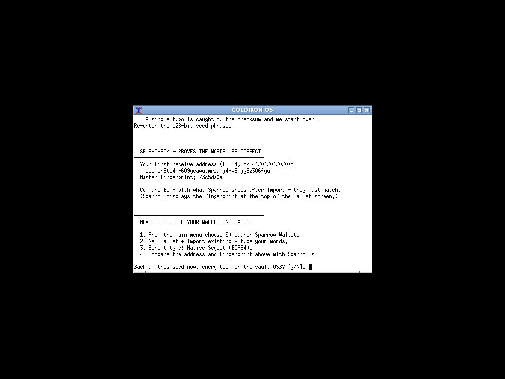
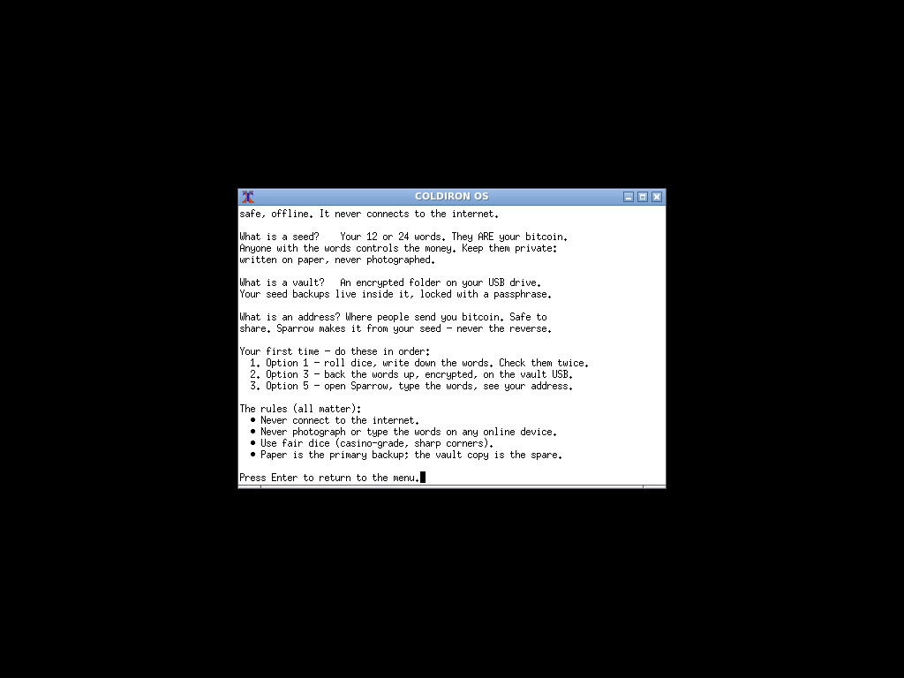
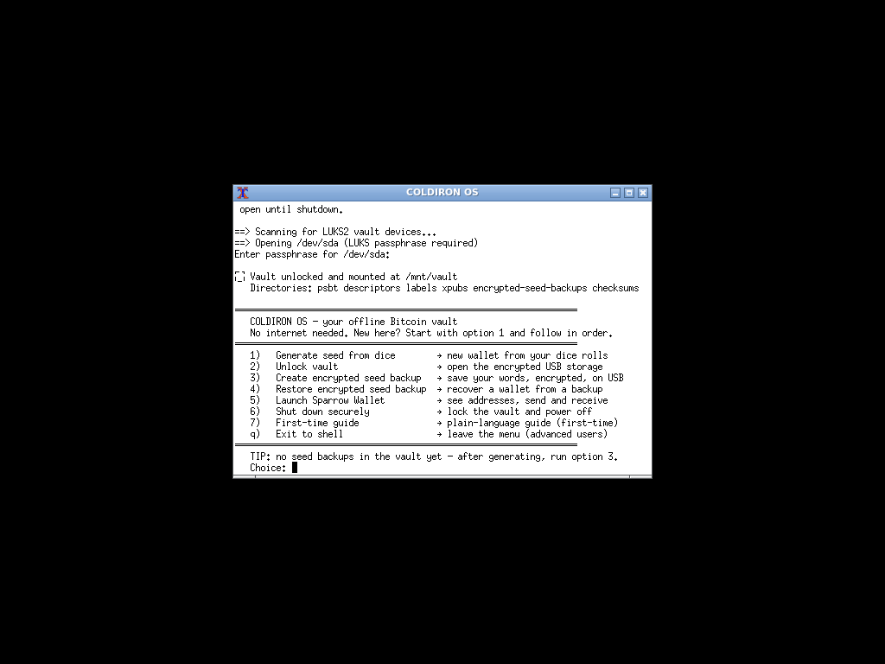
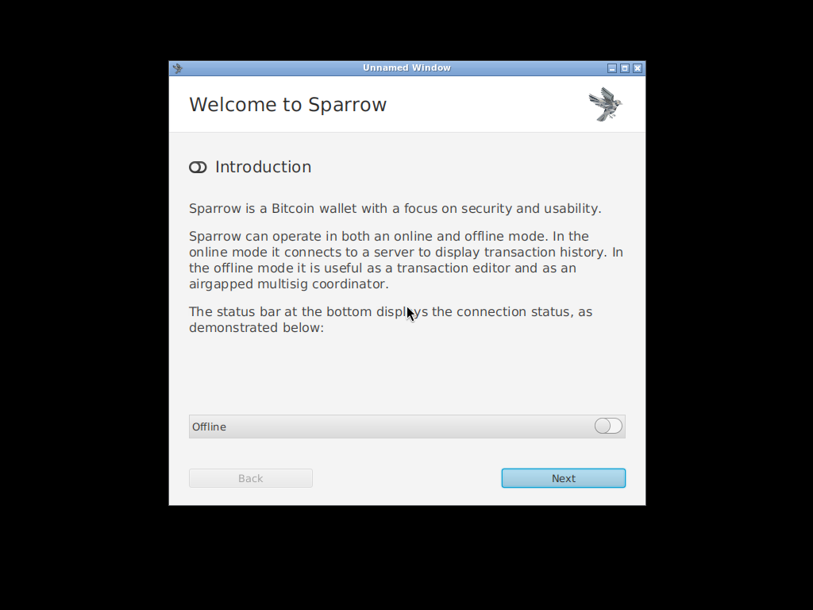

# COLDIRON OS

**Offline by design. Sovereign by default.**

> ✅ **STATUS: PRODUCT — v0.3.0 (first product release).** All seven
> product acceptance criteria in
> [docs/THREAT-MODEL.md](docs/THREAT-MODEL.md) are met and verified by
> the test suite: networkless monolithic kernel, GRUB-verified boot
> chain, enforced AppArmor, GPG-signed release artifacts and a
> demonstrated byte-reproducible build (local == CI == `9bebf36f…`).
> Caveat by design: the artifacts are signed with a **one-shot** key
> revoked immediately after signing — verify against the fingerprint in
> the [Download](#download) section
> ([docs/SIGNING.md](docs/SIGNING.md)). UEFI Secure Boot and
> hardware-wallet E2E remain future work, not prototype blockers.

## Table of Contents

- [The Problem](#the-problem)
- [What COLDIRON OS is](#what-coldiron-os-is)
- [Screenshots](#screenshots)
- [Architecture](#architecture)
- [Encryption model](#encryption-model--two-independent-layers)
- [Download](#download)
- [Quickstart](#quickstart)
- [In-image usage](#in-image-usage)
- [Documentation](#documentation)
- [Hardening notes (honest limitations)](#hardening-notes-current--honest-limitations)
- [License](#license)

## The Problem

Bitcoin self-custody has a weak point that no hardware wallet fully
solves: **the moment your private keys touch a machine that has ever been
online, they are one piece of malware away from being stolen.** Most
people use a "signing laptop" that is *supposed* to stay offline — but
"supposed to" is not a security control. A single careless connection,
an OS update, a Wi-Fi auto-join, or a Bluetooth misclick is enough to
compromise years of savings.

The standard answer — a dedicated hardware wallet — is good but not
universal: devices are single-vendor black boxes, firmware updates must
be trusted, supply chains are opaque, and the device itself can become a
single point of failure (lost, dead battery, broken screen, obsolete).

**COLDIRON OS takes a different approach: make the *entire computer* the
cold wallet.** A hardened Linux distribution that boots from a USB stick
you control, runs entirely from RAM, **is built without any networking
capability by design**, and ships with the tools you actually need for
air-gapped Bitcoin signing:

- **Sparrow Wallet** — the most widely used open-source desktop wallet,
  preinstalled and GPG-verified,
- **Bitcoin Core CLI tools** (`bitcoin-cli`, `bitcoin-tx`, `bitcoin-util`)
  for raw transaction inspection,
- a **LUKS2-encrypted vault USB** for PSBTs, descriptors and optional
  seed backups,
- QR-code tooling, `age` encryption, hardware-wallet/smartcard support
  via OpenSC.

Because the whole OS is built from source with `live-build`, **every
line of it is auditable and reproducible by anyone** — no vendor to
trust, no firmware to update, no "just trust us" anywhere. If the network
is physically impossible to reach, the malware has no way in; if the USB
is lost, the LUKS2 vault and the paper seed backups still protect you.

## What COLDIRON OS is

A small, purpose-built, auditable cold-storage appliance for Bitcoin that
happens to boot from USB. COLDIRON OS is a hardened Debian 13 (Trixie)
live-build image that:

- runs **entirely from RAM** (`toram`) — nothing is ever written back to
  the boot USB, power-off removes all state,
- **cannot network**: the kernel is compiled from source with **no
  network device drivers and no loadable modules** (`CONFIG_NETDEVICES=n`,
  `CONFIG_MODULES=n`; see `scripts/kernel/networkless.config`), plus
  driver blacklist and restrictive sysctls as defense in depth,
- **verifies its own boot files**: GRUB checks the kernel/initramfs PGP
  signatures (`check_signatures=enforce`) before executing them,
- **autologins to a minimal desktop** with a console launcher menu,
- **confines the appliance scripts** with enforced AppArmor profiles and
  ships an in-image **security check** (menu option 8) that proves the
  posture at runtime,
- ships **verified binaries only** (Sparrow manifest GPG-checked against
  *your* keyring; Bitcoin Core `SHA256SUMS.asc` GPG-checked against
  *your* keyring, plus pinned sha256),
- pairs with a **LUKS2-encrypted vault USB** for offline PSBT signing
  and optional encrypted seed backups.

## Screenshots

The launcher menu greets you after boot. Every option has a plain-language
description, and a contextual tip walks you through your first session:



Generate a brand-new wallet from **physical dice rolls** — the computer
never creates randomness, it only assembles what your dice decide:



Your seed words appear once, for paper only:



An in-app **self-check** derives your first receive address (BIP84) and
master fingerprint before you ever touch a wallet — compare both with what
Sparrow shows after import:



The first-time guide explains seeds, vaults and addresses in plain language:



Once the encrypted vault is open, the menu tells you exactly what to do next:



Sparrow Wallet ships preinstalled for offline PSBT signing:



## Architecture

```
USB #1 — COLDIRON OS (bootable, read-only)
├── Debian 13 live image, boots toram (runs entirely from RAM)
├── Kernel 6.12.101-coldiron — networkless & monolithic:
│   no network device drivers, no loadable modules (CONFIG_MODULES=n)
├── GRUB verified boot — pgp verify_detached + check_signatures=enforce
│   over kernel/initramfs (signed at build time, keys/boot/)
├── No persistent logs, no swap, no core dumps, kexec disabled
├── AppArmor enforced on all coldiron-* appliance scripts
├── Minimal X11/Openbox desktop + console launcher (options 1–8 + q)
├── Sparrow Wallet 2.5.3 (signed manifest + sha256 verified, see scripts/fetch-binaries.sh)
├── Bitcoin Core CLI tools (bitcoin-cli / bitcoin-tx / bitcoin-util)
├── QR tools (qrencode / zbar-tools), age, paperkey, wipe
└── pcscd + OpenSC + libusb for hardware-wallet / smartcard support

USB #2 — Encrypted Vault (LUKS2)
└── /vault
    ├── psbt/                    # unsigned / partially signed txs
    ├── descriptors/             # wallet output descriptors
    ├── labels/                  # wallet labels
    ├── xpubs/                   # extended public keys
    ├── encrypted-seed-backups/  # OPTIONAL age-encrypted seed files
    └── checksums/               # integrity records
```

### Encryption model — two independent layers

1. **LUKS2 container** — protects the entire vault USB if lost/stolen.
2. **age-encrypted seed file** — a separate passphrase protects the seed
   backup even if the LUKS passphrase is later compromised.

The seed backup is **strictly a tertiary recovery path**. The operational
rule is: metal plate (primary) → paper copy elsewhere (secondary) → LUKS2 +
age encrypted file (optional tertiary). The appliance forces an explicit
acknowledgement of this and verifies the physical backup before encrypting
anything digitally.

## Download

Prebuilt ISO: **[Releases](https://github.com/rurogge/coldiron-os/releases)**
→ `coldiron-os-0.3.0-amd64.iso` + `SHA256SUMS` (v0.3.0 is the security
pass: networkless monolithic kernel, GRUB-verified boot chain, enforced
AppArmor, full GPG verification of every staged binary, in-image security
check).

```sh
sha256sum -c SHA256SUMS     # → coldiron-os-0.3.0-amd64.iso: OK
gpg --keyserver keyserver.ubuntu.com --recv-keys 63EA0A22C16AD05182378B9B7F5397DF4477C2BD
gpg --verify SHA256SUMS.asc SHA256SUMS   # → "Good signature"
sudo dd if=coldiron-os-0.3.0-amd64.iso of=/dev/sdX bs=4M status=progress
```

> The release artifacts are GPG-signed with a **one-shot** project key
> (fingerprint `63EA 0A22 C16A D051 8237 8B9B 7F53 97DF 4477 C2BD`,
> pubkey in `keys/release.pub`) that was **revoked immediately after
> signing** — the signatures verify as "Good", the key shows as revoked
> by design, and the fingerprint above is the trust anchor (see
> [docs/SIGNING.md](docs/SIGNING.md)). For the strongest guarantee, build
> the ISO yourself (below) and compare hashes.

Full install instructions: [docs/INSTALL.md](docs/INSTALL.md).

## Quickstart

### 1. Import the Sparrow signing key (required once)

The build **refuses** to verify Sparrow with a key downloaded on the spot —
that would defeat the purpose. Follow the official instructions
(https://sparrowwallet.com/download/ → "Verifying the Release"), then:

```sh
gpg --keyserver keyserver.ubuntu.com --recv-keys D4D0D3202FC06849A257B38DE94618334C674B40
gpg --export D4D0D3202FC06849A257B38DE94618334C674B40 \
  | gpg --no-default-keyring --keyring keys/sparrow.gpg --import
gpg --no-default-keyring --keyring keys/sparrow.gpg --fingerprint   # confirm it
```

The same applies to Bitcoin Core: import the signers of
`SHA256SUMS.asc` into `keys/bitcoin.gpg` (see [keys/README.md](keys/README.md)).

### 2. Build

```sh
sudo ./build-root.sh            # on Debian hosts (or any host, simpler)
# or, recommended on Ubuntu hosts (trixie's own toolchain in a container):
sudo ./build-docker.sh
```

The first build also compiles the **networkless kernel** from Debian
source (~30–60 min, cached afterwards; see [docs/BUILD.md](docs/BUILD.md)).
~15–60 min for the rest, needs ~10 GB disk, 4 GB+ RAM. Output:
`dist/coldiron-os-0.3.0-amd64.iso`

### 3. Test in QEMU

```sh
./scripts/qemu-test.sh     # headless boot, console on stdio, Ctrl-A X to quit
```

The test VM gets a scratch 256 MB USB disk for the vault and **no network
device at all** — matching the appliance's threat model. The full
19-step / 3-boot E2E suite lives in `scripts/e2e/`.

### 4. Write to USB

```sh
dd if=dist/coldiron-os-0.3.0-amd64.iso of=/dev/sdX bs=4M status=progress
```

## In-image usage

| Command | Purpose |
|---|---|
| `coldiron-menu` | Launcher menu (also auto-starts with the desktop) |
| `coldiron-dice-seed` | Generate a BIP39 wallet from dice rolls (+ `--test` mode) |
| `coldiron-vault` | Unlock + mount the LUKS2 vault at `/mnt/vault` |
| `coldiron-digital-backup` | Optional age-encrypted seed backup (seed entered twice + 3-word spot check) |
| `coldiron-restore` | Decrypt a seed backup to the screen |
| `coldiron-shutdown` | Unmount, close vault, drop caches, power off |
| `coldiron-guide` | First-time guide (plain language) |
| `coldiron-check` | Security check: networkless kernel, no modules/interfaces, AppArmor, boot signatures (menu option 8) |

> 🔑 **Default credentials:** the console **autologins as root** on tty1
> (the appliance is offline and RAM-only — physical possession of the USB
> is the real authentication). The documented root password for other
> ttys / serial is `coldiron`; change it with `passwd` if you rely on it.

## Documentation

- [CHANGELOG.md](CHANGELOG.md) — what changed in each release
- [docs/INSTALL.md](docs/INSTALL.md) — download, verify, write to USB, first boot, vault setup
- [docs/USAGE.md](docs/USAGE.md) — the launcher menu, dice-wallet, PSBT signing workflow, seed backup/restore
- [docs/dice-seed.md](docs/dice-seed.md) — dice entropy math, security notes, proven test vectors
- [docs/BUILD.md](docs/BUILD.md) — build from source (incl. networkless kernel), verification model, troubleshooting
- [docs/TESTING.md](docs/TESTING.md) — host test suite + QEMU E2E harness and results
- [docs/THREAT-MODEL.md](docs/THREAT-MODEL.md) — what this protects, against whom, honest limitations, acceptance criteria
- [docs/VERSIONING.md](docs/VERSIONING.md) — version scheme, release process, PROTOTYPE→PRODUCT rule
- [docs/SIGNING.md](docs/SIGNING.md) — release signing ceremony (offline key, never networked)
- [docs/REVIEW.md](docs/REVIEW.md) — independent security review guide
- [docs/DR.md](docs/DR.md) — disaster recovery runbook
- [docs/HARDWARE-WALLETS.md](docs/HARDWARE-WALLETS.md) — hardware wallets & smartcards

## Repository layout

```
build.sh / build-root.sh / build-docker.sh   one-command ISO builders (run as root)
source-date-epoch                            pinned build timestamp (reproducible builds)
scripts/
├── fetch-binaries.sh        download + GPG-verify Sparrow + Bitcoin Core CLI (refuses without your keyrings)
├── build-kernel.sh          build the networkless monolithic kernel from Debian source (scripts/kernel/*.config)
├── qemu-test.sh             smoke-test the ISO in QEMU (headless)
├── host-tests.sh            host-side regression suite (dice-seed vectors, menu harness, guide render)
├── soak-test.sh             long-duration stability soak in QEMU
├── sign-release.sh          offline release signing (SHA256SUMS.asc, ISO .asc — needs the release key)
└── e2e/                     full QEMU E2E suite (19 steps, 3 boots incl. the real GRUB path)
keys/                        YOUR trusted signing keyrings (never auto-downloaded, gitignored)
└── boot/                    GRUB boot-signing key for the kernel/initramfs (committed by design)
config/
├── package-lists/coldiron.list.chroot    packages installed into the image
├── hooks/normal/0100-coldiron-setup.chroot
├── hooks/normal/9600-sign-boot.chroot    signs kernel + initramfs with keys/boot at build time
└── includes.chroot/                      files baked into the rootfs
    ├── etc/modprobe.d/blacklist-coldiron.conf   network/peripheral driver blacklist (defense in depth)
    ├── etc/sysctl.d/99-coldiron.conf            kernel hardening sysctls
    ├── etc/apparmor.d/                          enforced confinement profiles for coldiron-*
    └── usr/local/bin/                           coldiron-menu, coldiron-vault, coldiron-dice-seed,
                                                 coldiron-digital-backup, coldiron-restore,
                                                 coldiron-shutdown, coldiron-guide, coldiron-check
dist/                                     built ISO lands here (gitignored)
```

## Hardening notes (current — honest limitations)

**Implemented and verified (v0.3.0):**

- **Networkless kernel** — the kernel is compiled from Debian source with
  no network device drivers (`CONFIG_NETDEVICES=n`, wireless/BT/NFC/CAN
  off) and **no loadable modules** (`CONFIG_MODULES=n`). There is no
  driver that could talk to hardware and no module subsystem to insert
  one; the old "root loads a driver" attack is closed. Verified at boot
  by `coldiron-check`.
- **Verified boot chain** — GRUB loads the `pgp` module *before*
  `check_signatures=enforce`, verifies kernel + initramfs against the
  committed boot key, then executes. Tampering with the boot files
  prevents boot (fails closed). Residual: UEFI Secure Boot enrollment is
  future work; verify the downloaded ISO's sha256 before writing it.
- **AppArmor enforced** — profiles for the appliance scripts load and
  enforce at boot; `coldiron-check` asserts ≥ 4 profiles enforcing.
- **Full binary verification** — Sparrow manifest and Bitcoin Core
  `SHA256SUMS.asc` are GPG-verified against keyrings you import
  out-of-band; pinned sha256 cross-checks remain as a second layer.
- `toram` + `noswap` + `noresume` + volatile logs → no persistent OS
  state; restrictive sysctls (`kptr_restrict=2`, `dmesg_restrict=1`,
  core dumps off, `kexec_load_disabled=1`, BPF hardened); IPv6 compiled
  out of the kernel.
- **Signed release artifacts** — v0.3.0 `SHA256SUMS.asc` and `<iso>.asc`
  GPG-signed in the offline ceremony with a **one-shot** project key
  (fingerprint `63EA 0A22 C16A D051 8237 8B9B 7F53 97DF 4477 C2BD`);
  verify with `gpg --verify SHA256SUMS.asc SHA256SUMS` (see
  [Download](#download) and [docs/SIGNING.md](docs/SIGNING.md)).
- **Reproducible build** — the v0.3.0 ISO is byte-identical across
  independent local and CI builds (`9bebf36f…`, verified with `cmp`;
  see [docs/BUILD.md](docs/BUILD.md#reproducible-builds)).

**Future work (beyond the v0.3.0 product bar — see
[docs/THREAT-MODEL.md](docs/THREAT-MODEL.md)):**

- **UEFI Secure Boot** enrollment — GRUB's own signature enforcement
  covers kernel and initramfs, but the bootloader is not yet anchored to
  machine firmware.
- **Hardware-wallet end-to-end testing** on real devices — `pcscd`,
  OpenSC and libusb are installed, but the workflow is only exercised in
  QEMU (which cannot attach them).
- **Physical-adversary protections** (tamper-evident hardware,
  anti-glitch) remain explicitly out of scope.
- **Next release key** — the v0.3.0 one-shot signing key was revoked by
  design; v0.4.0 will be signed with a fresh key
  ([docs/SIGNING.md](docs/SIGNING.md)).

## Support

COLDIRON OS is free and stays free — nothing here is paywalled. If the
project has been useful to you, a donation to keep the AI-assisted
development running is welcome, never required:
[DONATIONS.md](DONATIONS.md) — BTC (BIP84), USDT (TRC20), USDC (ERC20).

## License

GPL-3.0-or-later (see LICENSE).

Copyright (C) 2026 the COLDIRON OS authors.
